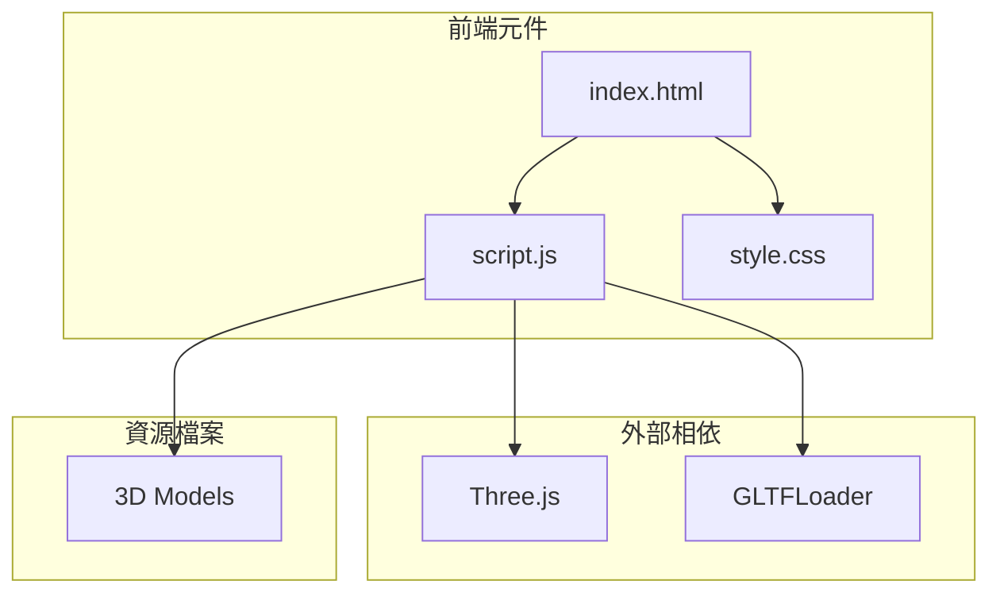
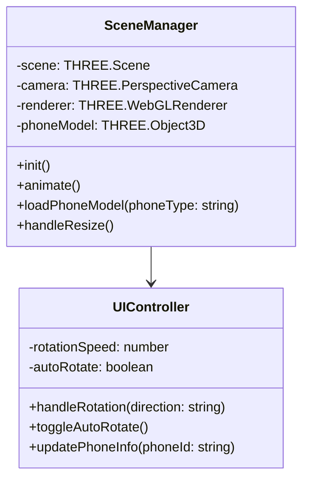
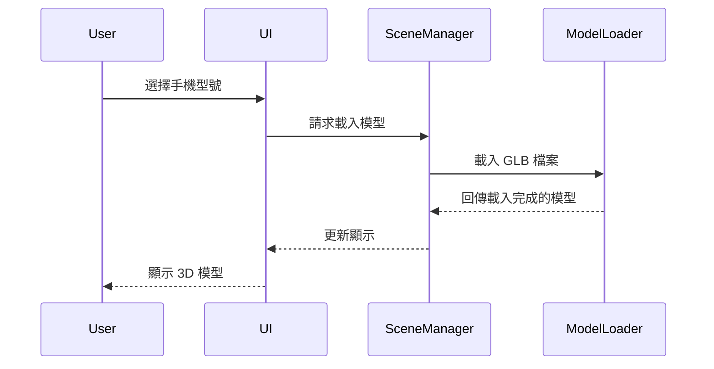

# 系統架構圖

## 元件結構

```mermaid
graph TB
    A[index.html] --> B[script.js]
    A --> C[style.css]
    B --> D[Three.js]
    B --> E[GLTFLoader]
    B --> F[3D Models]
    
    subgraph 前端元件
        A
        B
        C
    end
    
    subgraph 外部相依
        D
        E
    end
    
    subgraph 資源檔案
        F
    end
```

## 類別圖

```mermaid
classDiagram
    class SceneManager {
        -scene: THREE.Scene
        -camera: THREE.PerspectiveCamera
        -renderer: THREE.WebGLRenderer
        -phoneModel: THREE.Object3D
        +init()
        +animate()
        +loadPhoneModel(phoneType: string)
        +handleResize()
    }
    
    class UIController {
        -rotationSpeed: number
        -autoRotate: boolean
        +handleRotation(direction: string)
        +toggleAutoRotate()
        +updatePhoneInfo(phoneId: string)
    }
    
    SceneManager --> UIController
```

## 流程圖

```mermaid
sequenceDiagram
    participant User
    participant UI
    participant SceneManager
    participant ModelLoader
    
    User->>UI: 選擇手機型號
    UI->>SceneManager: 請求載入模型
    SceneManager->>ModelLoader: 載入 GLB 檔案
    ModelLoader-->>SceneManager: 回傳載入完成的模型
    SceneManager-->>UI: 更新顯示
    UI-->>User: 顯示 3D 模型
```